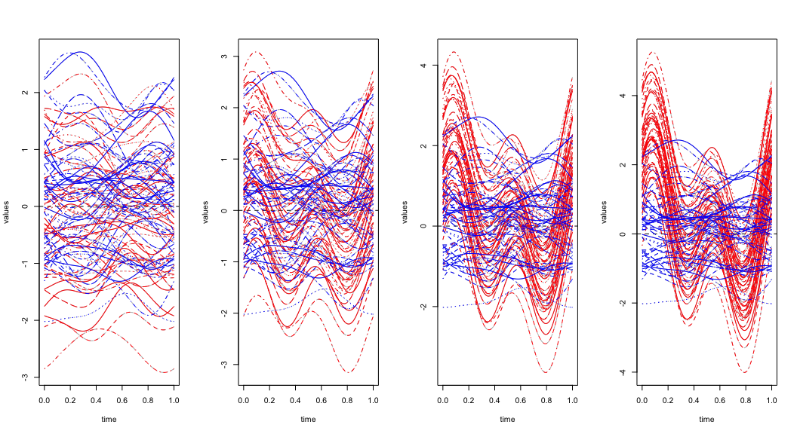

R package: fChange
================
Ozan Sonmez

-   [Introduction](#introduction)
-   [Data Generation Processes](#data-generation-processes)
    -   [Independent Functional Data](#independent-functional-data)
    -   [Heavy Tailed Functional Data](#heavy-tailed-functional-data)
    -   [Functional Auto Reggresive (FAR) Process](#functional-auto-reggresive-far-process)
    -   [Functional Moving Average (FMA) Process](#functional-moving-average-fma-process)
    -   [Inserting Artificial Changes](#inserting-artificial-changes)
-   [Functional Data Analysis Essentials:](#functional-data-analysis-essentials)
-   [Covariance Function Estimation](#covariance-function-estimation)
-   [Structural Break Analysis](#structural-break-analysis)
    -   [fPCA Based Methods](#fpca-based-methods)
    -   [Fully Functional Method](#fully-functional-method)
    -   [Confidence Interval](#confidence-interval)
-   [Data Sets](#data-sets)
    -   [Australian Temperature Data](#australian-temperature-data)
    -   [Stock Price Data](#stock-price-data)
-   [References](#references)

Introduction
============

The goal of this documentation is to illustrate the use of the R package `fChange`. The package is readily available in CRAN for download. This package is an comprehensive implementation of the structural break analysis in functional data where the methodologies are inherited from Aue, Rice, and Sönmez (2015), Berkes et al. (2009), Aue et al. (2009), and Aston and C. Kirch (2012a). The main functions of the `fChange` package will be discussed individually and the usage of these functions are illustrated by examples.

We will start with discussing some of the functional data generation processes such as simulating independent and heavy tailed functional data. Then the dependent functional data generations are discussed such as functional auto-regressive process (FAR) and functional moving average (FMA) processes. Most of the functional data analysis techniques requires an initial dimension reduction by projecting the functional variation onto smaller number of of leading eigenfunctions of the covariance operator (or long run covariance function in the case of dependent data), therefore we will next discuss covariance function (long run covariance function) estimation, and how to choose its tuning parameters. This will be followed by discussing the two major functions in the `fChange`package, i.e., detecting and dating functional structural breaks (1) with and (2) without dimension reduction. Finally, the functions in this package will be applied to real world data sets.

Data Generation Processes
=========================

In this section some of the basic functional data generating processes are discussed.

Independent Functional Data
---------------------------

The implementations here follows closely the DGP discussed in Aue, Rice, and Sönmez (2015), i.e., *n* functional data objects are generated using *D* basis functions *v*<sub>1</sub>, *v*<sub>2</sub>, …, *v*<sub>*D*</sub> on the unit interval \[0, 1\]. The independent curves are then generated according to the linear combinations of the chosen basis functions where the linear combination parameters are drawn from independent normal random variables with standard deviations *σ* = (*σ*<sub>1</sub>, …, *σ*<sub>*D*</sub>) which mimics the decay for the eigenvalues of the covariance operator.

``` r
fun_IID(n, nbasis, Sigma = NULL, basis = NULL, rangeval = c(0, 1), ...)
```

The above function generates an independent functional data of sample size *n* using `nbasis` number of basis with an eigenvalue decay of the covariance operator. The basis functions can be defined using basis functions in the `fda` package. The default is the Fourier basis. Below is an example of two independent data simulation with slow and fast decay of the igenvalues of the covariance operator, respectively.

``` r
set.seed(123)
N=100
D=21
Sigma_fast = 3^-(1:D)
Sigma_slow = (1:D)^-1
fdata_slow = fun_IID(n = N, nbasis = D, Sigma = Sigma_slow)
fdata_fast = fun_IID(n = N, nbasis = D, Sigma = Sigma_fast)
par(mfrow=c(1,2))
invisible(plot(fdata_slow, main="Slow Decay"))
invisible(plot(fdata_fast, main="Fast Decay"))
```

 In order to check whether we really simulated an independent functional data, one can plot the auto-correlation and partial auto-correlation functions of the scores of the principle components. Note that when we have a fast decay the smaller nuymber of prinicple components will explain most of the functional variation than the slow decay counter-part. This is also reflected in the plot of the functional data and how smooth the curves are, i.e., when the eigenvalue decay of the covariance function is faster, then one would expect that the generated cureves to be smaller than when the functional data has a slower eigenvalue decay. Assuming that we have the fast decay of the eigenvalues, one or two principle components would explain most of the variation in the data, therefore if there is any depedency that would also appear in the ACF plots of the scores:

``` r
scores = pca.fd(fdata_fast, nharm = D, centerfns = T)$scores
par(mfrow=c(2,2))
acf(scores[,1], main="First principle component, ACF")
pacf(scores[,1], main="First principle component, PACF")
acf(scores[,2], main="Second principle component, ACF")
pacf(scores[,2], main="Second principle component, PACF")
```

 The ACF and PACF plots of the first two principe components are evidence of the independence of the functional data that is generated here. The basis functions can be generated using the R package `fda` which is, without a doubt, one of the most popular basic tools to deal with functional data analysis in R programming environment. Some of the basis functions that can be used here are:

``` r
library(fda)
create.bspline.basis(...)
create.fourier.basis(...)
create.constant.basis(...)
create.exponential.basis(...)
create.power.basis()
create.monomial.basis(...)
create.polygonal.basis(...)
```

as a default, in all functional data generation processes, we use Fourier basis, however one can define any particular basis using the above `fda` functions.

Heavy Tailed Functional Data
----------------------------

It is often the case that the financial data is highly heavy tailed, and these can be, by nature, considered a functional data. For example, a particular Stock price is observed in one minute resolution from the opening to the closing of the Stock market. One can consider these as the discrete observations of the daily price function of that particular Stock price. Therefore, it might be useful to be able to mimic these realistic situations by simulating heavy tailed functional data.

The data generation process is very similar to the `fun_IID` function above, except that the linear combination (of the basis functions) coefficients are no longer follow a normal distribution but they are drawn from a t-distribution with a user defined degrees of freedom.

``` r
fun_heavy_tailed(n, nbasis, df = 3, basis = NULL, rangeval = c(0, 1), ...)
```

here is a simple example of heavy tailed functional data generation using B-spline basis basis functions

``` r
D = 21
range_val = c(0, 1)
bbasis = create.bspline.basis(rangeval = range_val, nbasis = D)
fdata_heavy_tailed = fun_heavy_tailed(n = 100, nbasis = D, basis = bbasis, rangeval = range_val)
invisible(plot(fdata_heavy_tailed, main="Heavy Tailed Functional Data"))
```


Functional Auto Reggresive (FAR) Process
----------------------------------------

The FAR data generation process is inherited from Aue, Rice, and Sönmez (2015). Once the independent curves are formed as in above, the functional auto-reggresive curves are generated using the appropriate recursion and the order. The functional autoreggresive curves of order *p* are generated using the autoreggresive recursions where the FAR operator was set up as *Ψ*<sub>*k*</sub> = *κ*<sub>*k*</sub>*Ψ*<sub>0</sub>, and the random operator *Ψ*<sub>0</sub> is represented by a *D* × *D* matrix whose entries consist of independent, centered normal random variables with standard deviations given by *σ* × *σ*′. A scaling was applied to achieve ||*Ψ*<sub>0</sub>|| = 1. The constant *κ*<sub>*k*</sub>, *k* = 1, …, *p* can then be used to adjust the strength of the temporal dependence. To ensure stationarity of the time series, the absolute value of the sum of the *κ*<sub>*k*</sub>'s must be smaller than 1.

``` r
fun_AR(n, nbasis, order = NULL, kappa = NULL, Sigma = NULL, basis = NULL, rangeval = c(0, 1), ...)
```

The above function generates FAR(p) process where `order` defines the order of the FAR operator *p*, where the the lag dependencies are defined by the `kappa` vector whose length must be same as *p*. The other arguments are similar to the one `fun_IID` function.

``` r
set.seed(12)
FAR1_fast = fun_AR(n = N, nbasis = D, order=1, kappa=0.75, Sigma = Sigma_fast)
scores_FAR1 = pca.fd(FAR1_fast, nharm = D, centerfns = T)$scores
par(mfrow=c(1,3))
invisible(plot(FAR1_fast, main="Fast Decay"))
acf(scores_FAR1[,1], main="ACF of the first PC")
pacf(scores_FAR1[,1], main="PACF of the first PC")
```

 Above we generated a functional time series which follows FAR(1) process where the norm of the FAR operator is 0.75, which measures the dependency strength. Note that the `Sigma` is chosen in a way that the eigenvalue decay of the covariance operator is "fast", which results in one or two principle components explaining most of the functional variation. To check the validity of the dependency structure of the functional data, we have also plotted the ACF and PACF of the scores associated with the leading principal component. ACF decaying exponentially and PACF having only one significant lag, is an evidence of the FAR(1) structure in the functional data.

Functional Moving Average (FMA) Process
---------------------------------------

Again, following the data generation process in Aue, Rice, and Sönmez (2015), below function generates functional moving average process of order *q*. The implimentation is very similar to the `fun_AR` with an appropriate recursion.

``` r
fun_MA(n, nbasis, order = NULL, kappa = NULL, Sigma = NULL, basis = NULL, rangeval = c(0, 1), ...)
```

Here is an example of FMA(1) data generation process:

``` r
set.seed(1)
FMA1_fast = fun_MA(n = N, nbasis = D, order=1, kappa=0.9, Sigma = Sigma_fast)
scores_FMA1 = pca.fd(FMA1_fast, nharm = D, centerfns = T)$scores
par(mfrow=c(1,3))
invisible(plot(FMA1_fast, main="Fast Decay"))
acf(scores_FMA1[,1], main="ACF of the first PC")
pacf(scores_FMA1[,1], main="PACF of the first PC")
```

 Once again, exponential decay of the pacf and ACF having only one significant lag is an evidence of the MA structure in the functional data.

Inserting Artificial Changes
----------------------------

The main focus of the `fChange` package is to date and detect the structural breaks (specially in the mean function) in the functional data, therefore for illustrative puposes, it is important to be able to insert artifical changes to do functional data with some specifications. This will allow us to compare and contrast different methods (will be discussed later) in a controled environment.

``` r
insert_change(fdobj, change_fun = NULL, k = NULL, change_location, SNR, plot = TRUE, ...)
```

This function will instert a change to the functional data `fdobj` where the inserted change can be given in two ways: (1) a custom change function `change_fun`, (2) change function which is the mean of first `k` basis functions (see Aue, Rice, and Sönmez (2015)). The location of the change is defined by `change_location` which is scaled by the sample size, hence this needs to be in \[0, 1\], for example 0.5 inserts the change in the middle of the data. The magnitude of the change is defined by the signal to noise ration `SNR`. If `plot=TRUE` then the plot of the resulted functional data is given colored by before (blue) and after (red) the change.

``` r
set.seed(1)
par(mfrow=c(1,4))
Fdata0 = insert_change(FAR1_fast, k=5, change_location = 0.5, SNR=0)
Fdata1 = insert_change(FAR1_fast, k=5, change_location = 0.5, SNR=1)
Fdata5 = insert_change(FAR1_fast, k=5, change_location = 0.5, SNR=5)
Fdata10 = insert_change(FAR1_fast, k=5, change_location = 0.5, SNR=10)
```



Above we inserted a the mean of the first 5 basis functions as an artificial change in the middle of the data generated that was generated before (FAR(1) data) with 4 different signal to noise ratio, i.e., 0, 1, 5 and 10.

Functional Data Analysis Essentials:
====================================

Majority of the functional data analysis techniques depends on the famous dimension reduction technique called "functional Principal Component Analysis" (fPCA), where the main idea is to project the functional data into small number of principle components. In other words the functional data is projected on to finite number of eigenfunctions of the covariance operator. One of the challanges in fPCA is to pick the right dimension, *d*, of the subspace that the functional data is projected onto. The rule of thumb, is picking the subspace dimension based on the Total Variation Explained (TVE) by the first *d* principal components, for example picking *d* when TVE exceeds 90 or 95 percent of the variation.

``` r
pick_dim(fdobj, TVE)
```

The above function takes the functional data `fdobj` and gives the number of principle components `d` that will explain at least `TVE` percent of the functional variation. It will also output the TVE for each additional principal components.

``` r
d_fast = pick_dim(fdata_fast, 0.95)
d_slow = pick_dim(fdata_slow, 0.95)
par(mfrow=c(1,2))
plot(d_fast$TVEs, main="Fast decay TVE", type="o")
plot(d_slow$TVEs, main="Slow decay TVE", type="o")
```


``` r
c(d_fast$d, d_slow$d)
```

    ## [1] 2 7

As it is expected the fast decay functional data requires 2 principle components to reach 95% TVE, while the slow decay functional data requires at least 7 principle components. This function is essential to pick the dimension of the projection space whenever the functional principle component analysis (fPCA) based methodolgy is applied.

Another esstential tool for functional data is to center the data by subtracting the mean function from each observation. However if there is a change in the mean function, one needs to estimate the change location and compute the mean function before and after the chnage and then subtract them from the data before and after the change, respectively. We extend the `fda` function `center.fd()` by also incorporating the possible change in the mean function.

``` r
center_data(fdobj, change = TRUE)
```

For an example lets compare theis function with `center.fd()`. Lets use the function `Fdata5` which has an inserted change with SNR=5.

``` r
par(mfrow=c(1,2))
invisible(plot(center.fd(Fdata5$fundata), main="center.fd()"))
invisible(plot(center_data(Fdata5$fundata), main="center_data()"))
```


As it is obvious from above example that `center.fd()` does not take into account any changes in the mean function when centering the data.

Covariance Function Estimation
==============================

In arenas of application including environmental science, economics, and medicine, it is increasingly common to consider time series of curves or functions (functional time series). Many inferential procedures employed in the analysis of such data involve the long run covariance function or operator, which is analogous to the long run covariance matrix familiar to finite dimensional time series analysis and econometrics. The long run covariance function operator alsp plays a crucial role in dating and detecting structural breaks in functional data. Following the notation and implementation of Aue, Rice, and Sönmez (2015) the long run covariance function is estimated using the below function in `fChange`.

``` r
LongRun(fdobj, h, kern_type = "BT", is_change = TRUE, ...)
```

which take s functional data obsject `fdobj` and estimates the long run covariance function using the bandwidth (window) parameter `h` and the kernel `kernel_type` by centering the data. If `is_change=TRUE` then the centering is done considering the change in the mean function (see `center_data`). The function will return to the eigenfunctions and eigenvalues of the long run covariance function along with the coefficinets of the spectral decomposition of the long run covariance function. The plot of the long run covariance function surface *C*(*t*, *s*) is also given. Note that *h* = 0 is used when the data is independent.

Here is an example for the independent functional data,

``` r
fdata_iid = fun_IID(n=100, nbasis=21)
C_iid = LongRun(fdata_iid, h=0)
```

here is the eigen values

``` r
lambda_hat = C_iid$e_val
lambda_hat
```

    ##  [1] 1.014544656 0.244323370 0.158091061 0.071215464 0.035495636
    ##  [6] 0.027074312 0.020384125 0.017457316 0.011753307 0.011390961
    ## [11] 0.008478114 0.006960599 0.006561260 0.005521724 0.003939815
    ## [16] 0.003500158 0.003043050 0.002453355 0.002243781 0.001698318
    ## [21] 0.001251050

and the plots of the eigenfunctions :

``` r
v_hat = C_iid$e_fun
invisible(plot(v_hat, main="eigen functions"))
```


Moreover the surface plot of the covariance function is given as:

``` r
C_iid$p
```


One can also see how the surface of the long run covariance function is changing based on the decay rate of the eigenvalues of the long run covariance operator. Below, two FAR(1) processes are generated and with slow and fast eigenvalue decay and the surface plots of the estimated long run covariance functions are displayed.

``` r
fdata_slow = fun_AR(n=100, nbasis=21, order = 1, kappa = 0.8) # slow decay
fdata_fast = fun_AR(n=100, nbasis=21, order = 1, kappa = 0.8, Sigma = 3^-(1:21)) # fast decay
C1 = LongRun(fdata_slow, h=2)
C2 = LongRun(fdata_fast, h=2)
C1$p # Slow decay C(t,s)
```


``` r
C2$p # Fast decay C(t,s)
```


The question of how to pick the optimal bandwidth `h` is investigated by Rice and H.L.Shang (2016) proposing a methid for a plug-in bandwidth selection procedure for long run covariance estimation with stationary functional time series.

``` r
opt_bandwidth(fdobj, kern_type, kern_type_ini, is_change = TRUE, ...)
```

For example, for the FAR(1) process generated above we used `h=2` but the optimal bandwith is estimated as:

``` r
OPT = opt_bandwidth(fdata_fast, "BT", "BT")
h_opt = floor(OPT$hat_h_opt)
h_opt
```

    ## [1] 6

Structural Break Analysis
=========================

Early work in functional structural break analysis dealt primarily with random samples of independent curves, the question of interest being whether all curves have a common mean function or whether there are two or more segments of the data that are homogeneous within but heterogeneous without. Berkes et al. (2009) developed statistical methodology to test the null hypothesis of no structural break against the alternative of a (single) break in the mean function assuming that the error terms are independent and identically distributed curves. Aue et al. (2009) quantified the large-sample behavior of a break date estimator under a similar set of assumptions. The work in these two papers was generalized by Aston and C. Kirch (2012a) and Aston and C. Kirch (2012b) to include functional time series exhibiting weak dependence into the modeling framework. Al these aforementioned papers makes use of an initial dimension reduction via fPCA, and Aue, Rice, and Sönmez (2015) developed methodology to uncover structural breaks in functional data that is “fully functional” in the sense that it does not rely on dimension reduction techniques.

fPCA Based Methods
------------------

Most of the procedures in FDA, such as those presented in the above cited papers, are based on dimension reduction techniques, primarily using the widely popular functional principal components analysis (fPCA), by which the functional variation in the data is projected onto the directions of a small number of principal curves, and multivariate techniques are then applied to the resulting sequence of score vectors. This is also the case in functional structural break detection, in which after an initial fPCA step multivariate structural break theory is utilized. Despite the fact that functional data are, at least in principle, infinite dimensional, the state of the art in FDA remains to start the analysis with an initial dimension reduction procedure. The fPCA based change point detector is based on standardized cumulative sum (CUSUM) statistics of the score vectors.

``` r
change_fPCA(fdobj, d, M = 1000, h = 0, plot = FALSE, ...)
```

The above function tests whether there is a significant change in the mean function of functional data, and it gives an estimate of the location of the change. The procedure will reduce the dimension of the functional data using functional principal component analysis and will use `d` leading principal curves to carry out the change point analysis. The projection dimension `d` can be chosen via total variation explained (TVE) using the function `pick_dim`.

``` r
set.seed(123)
datf = fun_AR(n = 100, nbasis = 21, order = 1, kappa = 0.75, Sigma = Sigma_fast)
dat_change = insert_change(datf, k=5, change_location = 0.5, SNR = 2.5, plot = FALSE)
fdata = dat_change$fundata
d_hat = pick_dim(fdata, 0.90)$d
fPCA_result = change_fPCA(fdata, d=d_hat, plot = TRUE)
```


``` r
fPCA_result$pvalue # estimated p-value 
```

    ## [1] 0.001

``` r
fPCA_result$change # estimated change point location
```

    ## [1] 50

Fully Functional Method
-----------------------

Dimension reduction approaches, however, automatically incur a loss of information, namely all informa- tion about the functional data that is orthogonal to the basis onto which it is projected. This weakness is easily illustrated in the context of detecting and dating structural breaks in the mean function: if the function representing the mean break is orthogonal to the basis used for dimension reduction, there cannot be a consistent test or estimator for the break date in that basis.

Aue, Rice, and Sönmez (2015) develop methodology for detecting and dating structural breaks in functional data without the application of dimension reduction techniques. In their work, fully functional test statistics and break date estimators are studied, and their asymptotic theory is developed under the assumption that the model errors satisfy a general weak dependence condition. This theory illuminates a number of potential advantages of the fully functional procedures. For example, it is shown that when the direction of the break is orthogonal to the leading principal components of the data, the estimation of the mean break is asymptotically improved when using the fully functional estimator compared to mean breaks of the same size that are contained in the leading principal components. This contrasts with fPCA based techniques in which such mean breaks are more difficult, if not impossible, to detect, even given arbitrarily large sample sizes. In addition, the assumptions required for the fully functional theory are weaker than the ones used in Aue et al. (2009) and Aston and C. Kirch (2012a), as convergence of the eigenvalues and eigenfunctions of the empirical covariance operator to the eigenvalues of the population covariance operator do not have to be accounted for. These assumptions are typically formulated as finiteness of fourth moment conditions.

``` r
change_FF(fdobj, M = 1000, h = 0, plot = FALSE, ...)
```

This function tests whether there is a significant change in the mean function of the functional data, and it will give an estimate for the location of the change. The procedure is based on the standard *L*<sup>2</sup> norm and hence does not depend on any dimension reduction technique such as fPCA.

``` r
LRCV = opt_bandwidth(fdata, "BT", "BT")
h_opt = floor(LRCV$hat_h_opt)
FF_result = change_FF(fdata, plot = TRUE)
```


``` r
FF_result$pvalue # estimated p-value 
```

    ## [1] 0

``` r
FF_result$change # estimated change point location
```

    ## [1] 50

The advantage of fully functional method is apperent, then most the change is in the later eigendirections but the fPCA is performed with few principal curves.

``` r
set.seed(123)
datf2 = fun_AR(n = 100, nbasis = 21, order = 1, kappa = 0.75, Sigma = Sigma_fast)
dat_change2 = insert_change(datf2, k=21, change_location = 0.5, SNR = 1, plot = FALSE)
fdata2 = dat_change2$fundata
d_hat2 = pick_dim(fdata2, 0.90)$d
fPCA_result2 = change_fPCA(fdata2, d=d_hat2)
LRCV2 = opt_bandwidth(fdata2, "BT", "BT")
h_opt2 = floor(LRCV2$hat_h_opt)
FF_result2 = change_FF(fdata2)
p_fPCA = fPCA_result2$pvalue 
c_fPCA = fPCA_result2$change 
p_FF = FF_result2$pvalue 
c_FF = FF_result2$change 
res = data.frame(method=c("fPCA", "FF"), p_value = c(p_fPCA, p_FF), location = c(c_fPCA, c_FF))
res
```

    ##   method p_value location
    ## 1   fPCA   0.297       41
    ## 2     FF   0.023       50

Note that in the above example, the change is spread over *D* = 21 eigen directions but the fPCA-based method is perfomed using *d* = 1, therefore the fully functional method is over performing the fPCA based method. Hence, whenever the signal of interest is not dominant or is “sparse”, in the sense that it is not entirely contained in the leading principal components, then alternatives to dimension reduction based methods should be considered and are likely more effective.

Confidence Interval
-------------------

The mathematical details of the confidence interval implimentation is given by Aue, Rice, and Sönmez (2015),

``` r
Conf_int(fdobj, h = 0, kern_type = "BT", alpha = 0.05, ...)
```

A change point in the mean function of functional data is estimated, and for a user selected level, aconfidence interval is computed using the fully functional procedure introduced Aue, Rice, and Sönmez (2015).

``` r
Conf_int(fdata, h=h_opt)
```

    ##         Lower CI Change(Location)         Upper CI 
    ##         49.26147         50.00000         50.73853

One can also illustrates that the confidence interval gets shrunken as the SNR gets larger:

``` r
set.seed(123)
fdata_ci = fun_AR(n = 100, nbasis = 21, order = 1, kappa = 0.75, Sigma = Sigma_fast)
CI_SNR = function(SNR){
  fdata_CI = insert_change(fdata_ci, k=21, change_location = 0.5, SNR = SNR, plot = F)$fundata
  LRCV = opt_bandwidth(fdata_CI, "BT", "BT")
  h_opt = floor(LRCV$hat_h_opt)
  Conf_int(fdata_CI, h = h_opt)
}
snr = c(0.25, 0.5, 0.75, 1, 3)
results = sapply(snr, function(k) CI_SNR(k))
snr_name = paste0("SNR=", snr)
colnames(results) = snr_name
t(results)
```

    ##           Lower CI Change(Location)  Upper CI
    ## SNR=0.25  3.084108               40 100.00000
    ## SNR=0.5  25.053826               41  76.88472
    ## SNR=0.75 48.440575               50  51.55942
    ## SNR=1    49.093166               50  50.90683
    ## SNR=3    49.841847               50  50.15815

Data Sets
=========

Australian Temperature Data
---------------------------

Australian daily minimum temperature climate data for 8 different stations are provided. The data is taken from Australian Government Bureau of Meteorology. The daily observations are available from <http://www.bom.gov.au/climate/data>. Copyright Commonwealth of Australia 2010, Bureau of Meteorology. Definitions adapted from <http://www.bom.gov.au/climate/dwo/IDCJDW0000.shtml>. The stations that the daily temperature data is taken are:

-   Sydney
-   Melbourne
-   Boulia
-   Cape\_Otway
-   Gayndah
-   Gunnedah
-   Hobart
-   Robe

For example the first couple rows the Sydney temerature data is given below:

``` r
head(Australian_Temp$Sydney)
```

    ##   Product.code Bureau.of.Meteorology.station.number Year Month Day
    ## 1   IDCJAC0011                                66062 1859     1   1
    ## 2   IDCJAC0011                                66062 1859     1   2
    ## 3   IDCJAC0011                                66062 1859     1   3
    ## 4   IDCJAC0011                                66062 1859     1   4
    ## 5   IDCJAC0011                                66062 1859     1   5
    ## 6   IDCJAC0011                                66062 1859     1   6
    ##   Minimum.temperature..Degree.C.
    ## 1                           14.5
    ## 2                           15.7
    ## 3                           15.3
    ## 4                           17.4
    ## 5                           16.9
    ## 6                           15.9
    ##   Days.of.accumulation.of.minimum.temperature Quality
    ## 1                                           1       Y
    ## 2                                           1       Y
    ## 3                                           1       Y
    ## 4                                           1       Y
    ## 5                                           1       Y
    ## 6                                           1       Y

we convert the above data into functional data by removing the `NA`'s first:

``` r
fun_data_S = Australian_Temp$Sydney
fun_data_S$md = with(fun_data_S, paste(Month, Day, sep="_"))
nas = which(is.na(fun_data_S$Days.of.accumulation.of.minimum.temperature))
fun_data_S = fun_data_S[-nas, ]
dataS = dcast(fun_data_S, formula = md~ Year, value.var = "Minimum.temperature..Degree.C.")[,-1]
D=21
basis = create.fourier.basis(rangeval = c(0, 1), nbasis = D)
mat.S = matrix(0, D, ncol(dataS))
for (i in 1:ncol(dataS)){
   vec = dataS[,i][!(is.na(dataS[,i]))]
   f_Obs = Data2fd(argvals=seq(0, 1, length = length(vec)) , vec, basisobj = basis)
   mat.S[, i] = f_Obs$coefs
}
fdata_S = fd(mat.S, basis)
invisible(plot(fdata_S, main="Sydney temp Data"))
```


``` r
h_opt = round(opt_bandwidth(fdata_S, "BT", "PR")$hat_h_opt)
change_FF(fdata_S, h=h_opt, plot = T)$change
```


    ## [1] 99

``` r
Conf_int(fdata_S, h=h_opt)
```

    ##         Lower CI Change(Location)         Upper CI 
    ##         88.53898         99.00000        101.81028

Stock Price Data
----------------

Stock prices in one minute resolution are recorded for

-   Bank of America
-   Walmart
-   Disney
-   Chevron
-   IBM
-   Microsoft
-   CocaCola
-   Exon mobile
-   McDonalds
-   Microsoft.

The time period that the observations span is given in the column names of each stock data. During each day, stock price values were recorded in one-minute intervals from 9:30 AM to 4:00 PM EST. The columns display the day, and the rows display the time at which the stock price is recorded.

``` r
# transform first 100 days of Chevron data into functional data object
 data = as.matrix(Stock$Chevron[,1:100])
 # First need to transform the data to obtain the log returns
 temp1=data
 for(j in c(1:dim(data)[1])){
  for(k in c(1:dim(data)[2])){
    data[j,k]=100*(log(temp1[j,k])-log(temp1[1,k]))
  }
}
# Transform the Log return data into functional data
#using 21 bspline basis functions on [0,1]
D=21
basis =  create.bspline.basis(rangeval = c(0, 1), nbasis = D)
Domain = seq(0, 1, length = nrow(data))
f_data = Data2fd(argvals = Domain , data, basisobj = basis)
plot(f_data)
```


    ## [1] "done"

References
==========

Aston, J.A.D., and & C. Kirch. 2012a. “Detecting and Estimating Changes in Dependent Functional Data.” *Journal of Multivariate Analysis.* 109.

———. 2012b. “Evaluating Stationarity via Change-Point Alternatives with Applications to Fmri Data.” *Annals of Applied Statistics.* 6.

Aue, A., R. Gabrys, L. Horváth, and P. Kokoszka. 2009. “Estimation of a Change-Point in the Mean Function of Functional Data.” *Journal of Multivariate Analysis.* 100.

Aue, A., G. Rice, and O. Sönmez. 2015. “Detecting and Dating Structural Breaks in Functional Data Without Dimension Reduction.” *Preprint.* <https://arxiv.org/abs/1511.04020>.

Berkes, I., R. Gabrys, L. Horváth, and P. Kokoszka. 2009. “Detecting Changes in the Mean of Functional Observations.” *Journal of the Royal Statistical Society, Series B.* 71.

Rice, G., and H.L.Shang. 2016. “A Plug-in Bandwidth Selection Procedure for Long Run Covariance Estimation with Stationary Functional Time Series.” *Journal of Time Series Analysis.*
